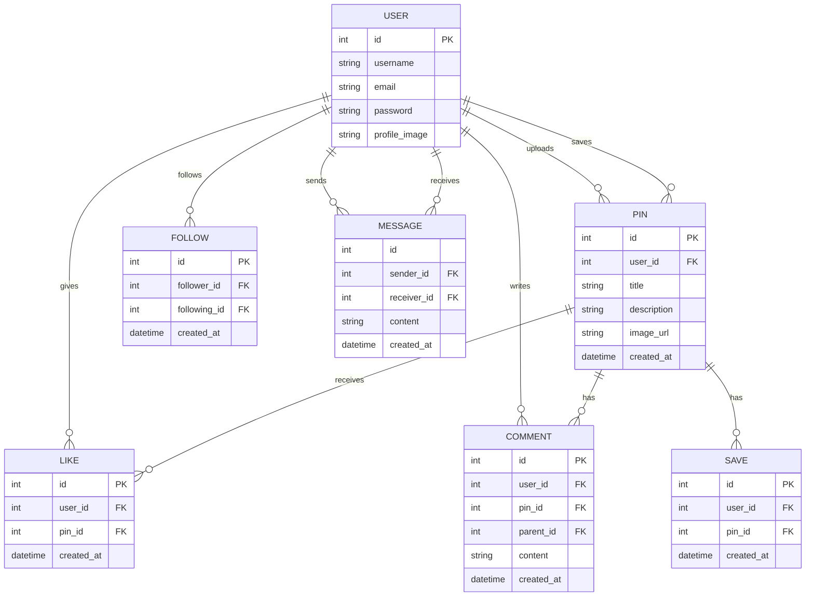

# Pinterest ER Diagram

```mermaid
erDiagram
    USER ||--o{ PIN : uploads
    USER ||--o{ PIN : saves
    USER ||--o{ LIKE : gives
    USER ||--o{ COMMENT : writes
    USER ||--o{ FOLLOW : follows

    PIN ||--o{ LIKE : receives
    PIN ||--o{ COMMENT : has
    PIN ||--o{ SAVE : has

    USER ||--o{ MESSAGE : sends
    USER ||--o{ MESSAGE : receives

    USER {
        int id PK
        string username
        string email
        string password
        string profile_image
    }


    PIN {
        int id PK
        int user_id FK
        string title
        string description
        string image_url
        datetime created_at
    }

    LIKE {
        int id PK
        int user_id FK
        int pin_id FK
        datetime created_at
    }

    COMMENT {
        int id PK
        int user_id FK
        int pin_id FK
        int parent_id FK
        string content
        datetime created_at
    }

    FOLLOW {
        int id PK
        int follower_id FK
        int following_id FK
        datetime created_at
    }

    SAVE {
        int id PK
        int user_id FK
        int pin_id FK
        datetime created_at
    }

    MESSAGE {
        int id
        int sender_id FK
        int receiver_id FK
        string content
        datetime created_at
    }

```

#### PIN
A PIN represents a design or post uploaded by a user.

#### SAVE
A SAVE represents a design or post saved by a user in his/her account.